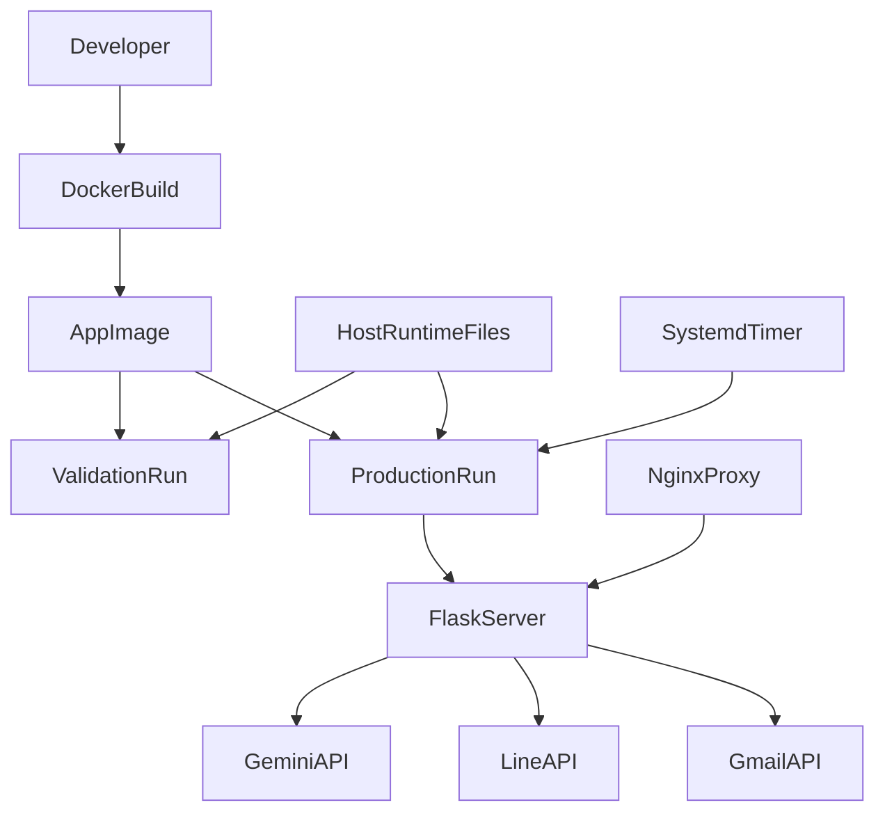
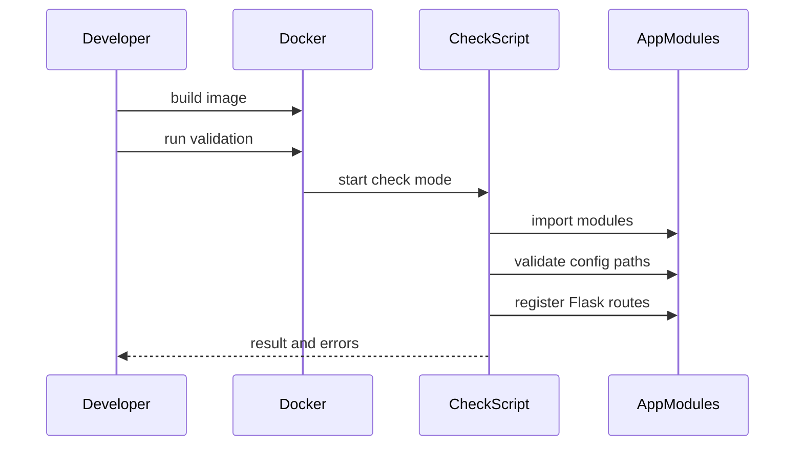
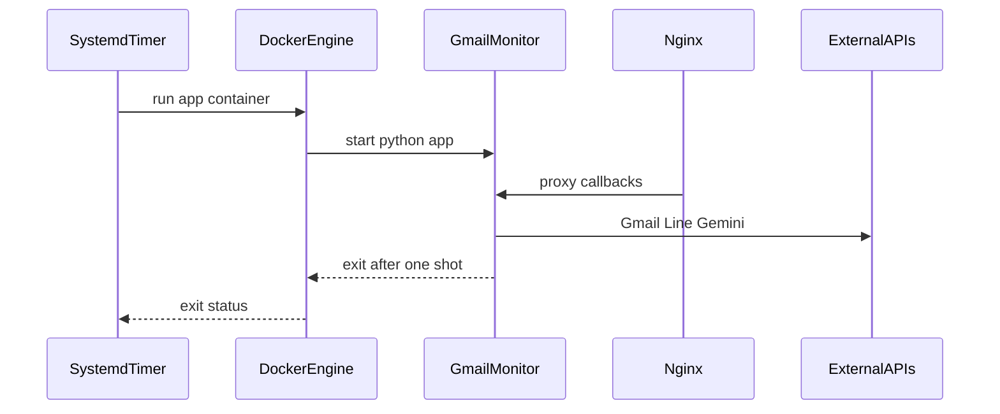
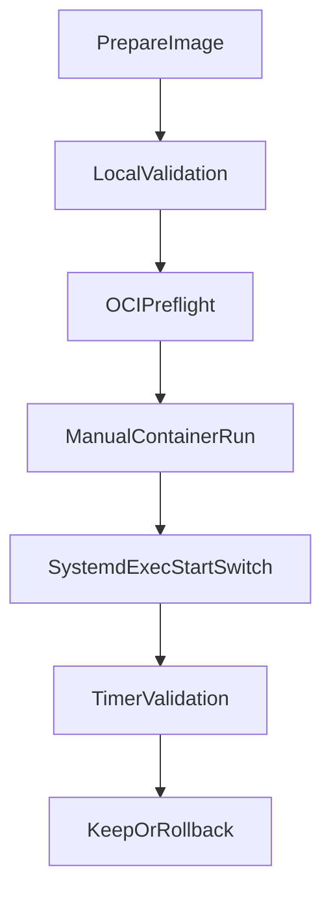

# Design Document

## Overview

この設計は Gmail Monitor のアプリ本体を Docker コンテナとして実行できるようにし、ローカル開発環境と OCI 実行環境の差分を減らす。対象ユーザーは開発者と運用者であり、ローカルでは同じイメージで import check / smoke test / Flask 起動確認を行い、OCI では既存の one-shot systemd timer 運用に接続できる状態を作る。

現行の Cloudflare、nginx、現行ドメイン、Google OAuth Console、LINE Developers Console、systemd timer のスケジュールは維持する。変更の中心は「Python 直起動部分をコンテナ実行へ置き換えるための実行境界」と「機密ファイルと永続ファイルをイメージ外で扱うための runtime 境界」である。

### Goals

- アプリ本体を再現可能な Docker image として build できる。
- `.env`, `credentials.json`, `token.json`, `filters.json`, `log/` を image 外で扱う。
- 外部 API を叩かない検証入口を提供する。
- OCI 上で host `127.0.0.1:8080` を維持し、既存 nginx から到達できる実行方式にする。
- Python 直起動へ戻せる rollback 判断材料を残す。

### Non-Goals

- Cloudflare/nginx の全面再設計。
- systemd timer のスケジュール変更。
- Secrets 管理 SaaS 導入。
- DB 導入、`filters.json` の永続層移行。
- マルチユーザー化。
- CI/CD または自動デプロイ基盤の本格導入。

## Boundary Commitments

### This Spec Owns

- Docker image build contract。
- Docker 実行時の env/mount/network contract。
- ローカルと OCI で使える検証 entrypoint。
- 既存 `app.py` one-shot 実行をコンテナ内で維持する実行設計。
- runtime path と Flask bind host を環境変数で切り替える最小アプリ変更。
- 移行、検証、rollback の運用ドキュメント。

### Out of Boundary

- nginx の `/callback` location 修正そのもの。
- Google OAuth Console / LINE Developers Console の設定変更。
- secret provider への移行。
- OAuth token の DB 管理。
- 常駐サービス化。
- 複数ユーザー向けの設定/認証再設計。

### Allowed Dependencies

- 既存 Python modules: `app.py`, `gmm_server.py`, `google_service.py`, `line_webhook.py`, `extract_gmail_content.py`, `ai_extractor.py`
- 既存 runtime files: `.env`, `credentials.json`, `token.json`, `filters.json`, `log/`
- Docker Engine on OCI Linux host
- Docker Desktop or Docker Engine on local development machine
- Existing host nginx proxy to `127.0.0.1:8080`
- Existing systemd timer and service shell boundary

### Revalidation Triggers

- Flask bind address, port, or endpoint path changes.
- Runtime file path or mount contract changes.
- `token.json` write behavior changes.
- `requirements.txt` dependency set or Python major/minor version changes.
- nginx upstream target changes.
- Any move from bind mounts to Docker volumes or external secret providers.

## Architecture

### Existing Architecture Analysis

Gmail Monitor is a flat Python/Flask application. `app.py` composes mixin-like service classes and runs a one-shot pipeline:

`start Flask -> authorize Gmail -> fetch Gmail -> filter/extract -> push LINE -> exit`

The current server binds to `127.0.0.1:8080` inside the Python process. In Docker bridge networking, container loopback is not host loopback, so the design must avoid relying on container `127.0.0.1` being visible to host nginx.

### Architecture Pattern & Boundary Map

Selected pattern: **container wrapper with runtime configuration seam**.

The image owns code and dependencies. The host owns secrets, token, filters, logs, nginx, and timer scheduling. A small validation script owns non-production checks without changing the production one-shot pipeline.



Key decisions:

- Container process binds to `GMM_FLASK_HOST=0.0.0.0` when running in Docker.
- Docker publishes host `127.0.0.1:8080` to container `8080`.
- Runtime files are mounted under `/runtime` in the container.
- `app.py` keeps production behavior; `scripts/container_check.py` handles non-production checks.

### Technology Stack

| Layer | Choice / Version | Role in Feature | Notes |
|-------|------------------|-----------------|-------|
| Backend / Services | Python 3.9 series | Runtime parity with current OCI Python 3.9.21 | Revisit after container baseline is stable |
| Backend / Services | Flask 3.1.2 | Existing callback and health endpoints | No framework change |
| Backend / Services | Existing Google/LINE/Gemini libraries | Existing external integrations | Versions remain pinned through `requirements.txt` |
| Infrastructure / Runtime | Docker Engine | Build and run app image | OCI prerequisite |
| Infrastructure / Runtime | Docker bind mounts | Runtime files and logs | First-stage migration; no secret manager yet |
| Operations | systemd timer/service | Existing one-shot scheduling | `ExecStart` target changes only |

## File Structure Plan

### Directory Structure

```text
.
├── Dockerfile
├── .dockerignore
├── compose.yaml
├── app.py
├── gmm_server.py
├── requirements.txt
├── scripts/
│   └── container_check.py
└── docs/
    └── app-containerization.md
```

### New Files

- `Dockerfile` - Builds the Gmail Monitor image, installs Python dependencies, sets `/app` as code workdir, and defaults to production one-shot command.
- `.dockerignore` - Excludes `.env`, credentials, tokens, logs, caches, notes, screenshots, local tooling, and virtual environments from image context.
- `compose.yaml` - Provides a local build/check/run wrapper with explicit env file, mounts, and host loopback port publishing.
- `scripts/container_check.py` - Runs import/config/route checks without Gmail fetch, LINE push, or Gemini API calls.
- `docs/app-containerization.md` - Documents local commands, OCI run command shape, mount contract, validation checklist, and rollback notes.

### Modified Files

- `app.py` - Add environment-driven configuration for `GMM_FLASK_PORT`, `GMM_CREDS_PATH`, `GMM_TOKEN_PATH`, `GMM_FILTER_PATH`, and `GMM_NUMBER_TO_FETCH` while preserving current defaults.
- `gmm_server.py` - Add `GMM_FLASK_HOST` support, defaulting to `127.0.0.1`, so Docker can bind `0.0.0.0` without changing non-container behavior.
- `requirements.txt` - Normalize package names and include OCI runtime dependency gaps only when directly required by the current app.
- `.syncignore` - Reassess whether `.dockerignore`, `Dockerfile`, `compose.yaml`, `scripts/`, and `docs/` should sync to OCI while keeping secret/token/log exclusions.

## System Flows

### Local Validation Flow



The validation flow never calls Gmail, LINE, or Gemini. It confirms the image can import the app, read non-secret runtime configuration shape, and expose expected Flask routes.

### OCI Production Run Flow



The container replaces only the Python process. systemd scheduling and nginx proxy responsibilities remain outside this spec.

## Requirements Traceability

| Requirement | Summary | Components | Interfaces | Flows |
|-------------|---------|------------|------------|-------|
| 1.1 | Build executable image | DockerImageDefinition | Docker build contract | Local Validation |
| 1.2 | Include Python dependencies | DockerImageDefinition, DependencyManifest | requirements contract | Local Validation |
| 1.3 | Exclude secrets from image | DockerIgnorePolicy, RuntimeMountContract | build context exclusions | Local Validation |
| 1.4 | Detect dependency build failure | DockerImageDefinition | build exit status | Local Validation |
| 2.1 | Accept env/env file settings | RuntimeConfigContract | environment variables | OCI Production |
| 2.2 | Use external JSON files | RuntimeMountContract, AppConfigRuntime | path variables | OCI Production |
| 2.3 | Persist token updates | RuntimeMountContract | writable token path | OCI Production |
| 2.4 | External logs | RuntimeMountContract, GMMServerRuntime | log env variables | OCI Production |
| 2.5 | Exclude secret/token from image | DockerIgnorePolicy | build context exclusions | Local Validation |
| 3.1 | Import check | ValidationEntrypoint | check command | Local Validation |
| 3.2 | No external API smoke test | ValidationEntrypoint | check modes | Local Validation |
| 3.3 | Flask startup check | ValidationEntrypoint, GMMServerRuntime | route check | Local Validation |
| 3.4 | Missing file errors | ValidationEntrypoint | check result envelope | Local Validation |
| 4.1 | Preserve one-shot flow | ProductionEntrypoint | default command | OCI Production |
| 4.2 | Exit after run | ProductionEntrypoint | process exit status | OCI Production |
| 4.3 | nginx local reachability | NetworkPublishContract, GMMServerRuntime | port publish | OCI Production |
| 4.4 | Failure observability | ProductionEntrypoint, RuntimeMountContract | logs and exit status | OCI Production |
| 4.5 | Rollback material | OperationsGuide | documentation contract | OCI Production |
| 5.1 | No external setting changes required | NetworkPublishContract, OperationsGuide | compatibility checklist | OCI Production |
| 5.2 | Preserve OAuth endpoint | AppConfigRuntime | Flask route contract | OCI Production |
| 5.3 | Preserve LINE endpoint | AppConfigRuntime | Flask route contract | OCI Production |
| 5.4 | Mark callback risk | OperationsGuide | validation checklist | OCI Production |
| 6.1 | No Secrets SaaS | BoundaryCommitment | scope contract | All |
| 6.2 | No filters DB migration | BoundaryCommitment | scope contract | All |
| 6.3 | No multi-user work | BoundaryCommitment | scope contract | All |
| 6.4 | No CI/CD requirement | BoundaryCommitment | scope contract | All |
| 6.5 | Leave downstream baseline | OperationsGuide, ResearchLog | docs and research | All |

## Components and Interfaces

| Component | Domain/Layer | Intent | Req Coverage | Key Dependencies | Contracts |
|-----------|--------------|--------|--------------|------------------|-----------|
| DockerImageDefinition | Runtime | Build app image | 1.1, 1.2, 1.4 | requirements.txt P0 | Batch |
| DockerIgnorePolicy | Runtime | Protect build context | 1.3, 2.5 | .gitignore P1 | State |
| RuntimeMountContract | Runtime | Define mounted files | 2.2, 2.3, 2.4 | host files P0 | State |
| RuntimeConfigContract | Runtime | Define env variables | 2.1, 2.2 | `.env` P0 | State |
| NetworkPublishContract | Runtime | Preserve host loopback endpoint | 4.3, 5.1 | Docker Engine P0, nginx P0 | Batch |
| ProductionEntrypoint | App Runtime | Run one-shot app | 4.1, 4.2, 4.4 | app.py P0 | Batch |
| ValidationEntrypoint | Validation | Run no-API checks | 3.1, 3.2, 3.3, 3.4 | app modules P0 | Batch |
| AppConfigRuntime | App Runtime | Map env paths into app config | 2.2, 5.2, 5.3 | app.py P0 | Service |
| GMMServerRuntime | App Runtime | Bind host and log config | 2.4, 4.3 | gmm_server.py P0 | Service |
| OperationsGuide | Operations | Migration and rollback docs | 4.5, 5.4, 6.5 | research.md P1 | State |
| BoundaryCommitment | Spec Boundary | Keep adjacent work out | 6.1, 6.2, 6.3, 6.4 | requirements P0 | State |

### Runtime Layer

#### DockerImageDefinition

| Field | Detail |
|-------|--------|
| Intent | Build a runnable image for the existing Python application |
| Requirements | 1.1, 1.2, 1.4 |

**Responsibilities & Constraints**

- Build from a Python 3.9 series base image.
- Install `requirements.txt` into the image.
- Copy only source and non-sensitive project files.
- Default command remains production one-shot: `python -u app.py`.

**Dependencies**

- Inbound: Developer or systemd build/deploy workflow - invokes image build (P1)
- Outbound: `requirements.txt` - dependency source (P0)
- External: Python Official Image - base runtime (P0)

**Contracts**: Batch [x] / State [ ] / Service [ ] / API [ ] / Event [ ]

##### Batch / Job Contract

- Trigger: `docker build` or compose build.
- Input / validation: build context excludes secret/token/log files.
- Output / destination: local Docker image tagged for Gmail Monitor.
- Idempotency & recovery: repeated build replaces image tag; build failure does not modify runtime files.

**Implementation Notes**

- Validation: build must fail on dependency install errors.
- Risks: slim image may require OS packages if transitive dependencies need compilation.

#### RuntimeMountContract

| Field | Detail |
|-------|--------|
| Intent | Keep runtime files outside the image and define writable/read-only behavior |
| Requirements | 2.2, 2.3, 2.4 |

**Responsibilities & Constraints**

- `.env` is passed as an env file, not copied into the image.
- `credentials.json` and `filters.json` are mounted read-only.
- `token.json` is mounted writable because the app refreshes credentials.
- `log/` is mounted writable when file logging is enabled.

**Dependencies**

- Inbound: Docker run/compose - provides mounts (P0)
- Outbound: `google_service.py` - reads and writes token path (P0)
- Outbound: `extract_gmail_content.py` - reads filter path (P0)

**Contracts**: State [x]

##### State Management

- State model:
  - `/runtime/credentials.json`: read-only OAuth client file.
  - `/runtime/token.json`: read-write OAuth token file.
  - `/runtime/filters.json`: read-only filter rules.
  - `/runtime/log/`: read-write log directory.
- Persistence & consistency: host filesystem is source of truth.
- Concurrency strategy: one-shot service assumes single active run.

**Implementation Notes**

- Validation: check script verifies path existence and token writability when token path exists.
- Risks: missing file bind mounts fail before app starts; docs must include preflight.

#### NetworkPublishContract

| Field | Detail |
|-------|--------|
| Intent | Make container Flask reachable through host loopback |
| Requirements | 4.3, 5.1 |

**Responsibilities & Constraints**

- Container app binds `0.0.0.0:8080`.
- Docker publishes host `127.0.0.1:8080` to container `8080`.
- nginx remains configured against host loopback.
- host network mode is not the default design.

**Dependencies**

- Inbound: nginx - connects to host loopback (P0)
- Outbound: Docker Engine - port publishing (P0)
- External: Docker bridge networking (P0)

**Contracts**: Batch [x]

##### Batch / Job Contract

- Trigger: container start.
- Input / validation: requested host port must be free.
- Output / destination: Flask reachable from host at `http://127.0.0.1:8080/health`.
- Idempotency & recovery: failed port bind prevents container start and leaves current nginx config unchanged.

### Application Runtime Layer

#### AppConfigRuntime

| Field | Detail |
|-------|--------|
| Intent | Allow container runtime paths without breaking existing defaults |
| Requirements | 2.2, 5.2, 5.3 |

**Responsibilities & Constraints**

- Preserve existing defaults: `credentials.json`, `token.json`, `filters.json`, port `8080`.
- Add environment overrides:
  - `GMM_CREDS_PATH`
  - `GMM_TOKEN_PATH`
  - `GMM_FILTER_PATH`
  - `GMM_NUMBER_TO_FETCH`
  - `GMM_FLASK_PORT`
- Do not change OAuth or LINE endpoint paths.

**Dependencies**

- Inbound: `app.py main()` - constructs config (P0)
- Outbound: `GoogleService` - consumes credential/token paths (P0)
- Outbound: `ExtractGmailContent` - consumes filter path (P0)

**Contracts**: Service [x] / State [x]

##### Service Interface

```python
def build_app_config_from_env() -> AppConfig:
    ...
```

- Preconditions: environment variables may be absent.
- Postconditions: returned config preserves current defaults when env is absent.
- Invariants: no secret value is logged.

**Implementation Notes**

- Validation: unit/import check validates defaults and env override mapping.
- Risks: malformed integer env values must fail with a clear message.

#### GMMServerRuntime

| Field | Detail |
|-------|--------|
| Intent | Support Docker bind host while preserving non-container default |
| Requirements | 2.4, 4.3 |

**Responsibilities & Constraints**

- Add `GMM_FLASK_HOST` support.
- Default remains `127.0.0.1`.
- Container run sets `GMM_FLASK_HOST=0.0.0.0`.
- Existing `/health`, `/`, `/oauth/start`, `/oauth/callback`, `/callback` routes remain unchanged.

**Dependencies**

- Inbound: `GmailMonitor` - starts Flask (P0)
- Outbound: Flask - binds host/port (P0)
- Outbound: logging - stdout and optional file log (P1)

**Contracts**: Service [x]

##### Service Interface

```python
class GMMServer:
    def __init__(self, flask_port: int = 8080, env_key_for_domain: str = "SERVER_DOMAIN", flask_host: str | None = None) -> None:
        ...
```

- Preconditions: `flask_host` or `GMM_FLASK_HOST` is a valid bind address.
- Postconditions: Flask starts on configured host and port.
- Invariants: default local behavior remains unchanged.

### Validation Layer

#### ValidationEntrypoint

| Field | Detail |
|-------|--------|
| Intent | Verify container viability without external API side effects |
| Requirements | 3.1, 3.2, 3.3, 3.4 |

**Responsibilities & Constraints**

- Import runtime modules.
- Validate configured paths and mount presence.
- Instantiate app enough to inspect route registration where possible.
- Optionally run a short Flask route check without Gmail/LINE/Gemini calls.
- Never call Gmail API, LINE push/quota API, or Gemini API.

**Dependencies**

- Inbound: Developer/compose - invokes validation command (P0)
- Outbound: app modules - import and inspect (P0)
- External: none for API calls (P0 constraint)

**Contracts**: Batch [x]

##### Batch / Job Contract

- Trigger: `python scripts/container_check.py`.
- Input / validation: environment and mount paths.
- Output / destination: console result and process exit code.
- Idempotency & recovery: no runtime state mutation except optional temporary test resources.

**Implementation Notes**

- Validation: missing required file returns non-zero with explicit file label.
- Risks: constructing full `GmailMonitor` may initialize LINE SDK with empty secret; script should isolate checks to avoid API calls.

### Operations Layer

#### OperationsGuide

| Field | Detail |
|-------|--------|
| Intent | Make migration and rollback executable by an operator |
| Requirements | 4.5, 5.4, 6.5 |

**Responsibilities & Constraints**

- Document local build/check/run.
- Document OCI build/run shape.
- Document systemd `ExecStart` replacement pattern.
- Document preflight checks for `/callback`, mounts, token writability, and port reachability.
- Document rollback to `/opt/gmm_project/GmmEnv/bin/python -u app.py`.

**Dependencies**

- Inbound: Operator - follows guide (P0)
- Outbound: Docker CLI - command examples (P1)
- Outbound: systemd/nginx - validation points only (P1)

**Contracts**: State [x]

##### State Management

- State model: documentation is the operational contract for manual migration.
- Persistence & consistency: doc must be updated with any command or mount contract change.

## Data Models

### Domain Model

No application domain data model changes are introduced. Gmail messages, filters, OAuth tokens, and LINE notifications keep their current runtime behavior.

### Logical Data Model

Runtime files are treated as operational state:

| Runtime Item | Container Path | Access | Source of Truth | Notes |
|--------------|----------------|--------|-----------------|-------|
| env file | not mounted as file by default | read at process start | host file | passed via Docker env file |
| OAuth client | `/runtime/credentials.json` | read-only | host file | required for OAuth flow |
| OAuth token | `/runtime/token.json` | read-write | host file | refreshed by app |
| filters | `/runtime/filters.json` | read-only | host file | current filter schema unchanged |
| logs | `/runtime/log/` | read-write | host directory | optional if stdout logs are sufficient |

### Data Contracts & Integration

Environment variables added or standardized by this spec:

| Variable | Default | Purpose |
|----------|---------|---------|
| `GMM_FLASK_HOST` | `127.0.0.1` | Flask bind address |
| `GMM_FLASK_PORT` | `8080` | Flask bind port |
| `GMM_CREDS_PATH` | `credentials.json` | OAuth client file path |
| `GMM_TOKEN_PATH` | `token.json` | OAuth token file path |
| `GMM_FILTER_PATH` | `filters.json` | filter config path |
| `GMM_NUMBER_TO_FETCH` | `10` in `main()` | Gmail fetch count |
| `GMM_LOG_FILE` | unset | optional log file |
| `GMM_LOG_LEVEL` | `INFO` | log level |
| `GMM_LOG_MODE` | `append` | file log initialization |

Existing variables remain valid: `SERVER_DOMAIN`, `LINE_CHANNEL_ACCESS_TOKEN`, `LINE_CHANNEL_SECRET`, `MY_LINE_UID`, `GEMINI_API_KEY`, `GEMINI_MODELS`, `GMM_HTTP_TIMEOUT`, `GMM_GMAIL_BASE`.

## Error Handling

### Error Strategy

- Build errors fail fast through Docker build exit code.
- Validation errors fail fast with specific missing/misconfigured item labels.
- Production runtime errors continue to use existing logger and process exit status.
- Mount/permission errors are reported before external API calls where possible.

### Error Categories and Responses

- Build failure: dependency install or syntax/import issue stops image creation.
- Missing runtime file: validation fails with the expected path and variable name.
- Token write failure: validation reports `GMM_TOKEN_PATH` writability failure.
- Port bind failure: Docker run fails before service migration proceeds.
- External API failure: existing app behavior and logging remain unchanged.

### Monitoring

- stdout remains primary log channel for Docker/systemd journal.
- `GMM_LOG_FILE` remains available for file logging into mounted `/runtime/log/`.
- OCI validation includes `docker logs`, process exit status, and `curl http://127.0.0.1:8080/health`.

## Testing Strategy

### Unit and Static Checks

- Validate `build_app_config_from_env()` preserves defaults and applies env overrides for 2.1, 2.2.
- Validate `GMM_FLASK_HOST` default and override behavior for 4.3.
- Validate `.dockerignore` excludes `.env`, `credentials.json`, `token.json`, `log/`, caches, and local venv for 1.3, 2.5.

### Container Build Checks

- Build image from clean context and verify dependency installation for 1.1, 1.2, 1.4.
- Inspect image or build context behavior to confirm secret/token files are not copied for 1.3, 2.5.
- Run `python scripts/container_check.py` inside image for 3.1, 3.2, 3.4.

### Runtime Integration Checks

- Run container with env file and mounts and verify `/health` through host `127.0.0.1:8080` for 3.3, 4.3.
- Verify `token.json` path is writable in the container for 2.3.
- Verify `GMM_LOG_FILE=/runtime/log/gmm_app.log` creates or appends to mounted log directory for 2.4.

### OCI Migration Checks

- Confirm Docker is installed and current user/systemd context can run the image.
- Confirm existing Python direct command can still be restored for rollback for 4.5.
- Confirm nginx `/oauth/callback` and `/callback` reachability before and after container run for 5.2, 5.3, 5.4.
- Confirm systemd timer triggers one-shot container and records exit status for 4.1, 4.2, 4.4.

## Security Considerations

- Secrets and OAuth tokens must not enter Docker image layers or build context.
- `credentials.json` and `filters.json` should be mounted read-only where Docker supports it.
- `token.json` requires write access but should remain restricted on the host.
- The container should run with only the mounts and environment needed for this app.
- Host loopback publishing limits Flask exposure to local nginx rather than public interfaces.

## Migration Strategy



### Phases

1. Prepare image and validation script locally.
2. Validate image without external API calls.
3. Confirm OCI Docker availability, runtime mounts, port availability, and `/callback` risk.
4. Run container manually on OCI with host loopback publish.
5. Replace only systemd service `ExecStart` after manual validation passes.
6. Validate next timer run and logs.
7. Roll back to `/opt/gmm_project/GmmEnv/bin/python -u app.py` if container start, mount, or callback validation fails.

## Supporting References

- Docker network drivers: bridge is default; host network removes network isolation and has platform constraints.
- Docker bind mounts: suitable for first-stage use of existing host files, but tied to host path structure.
- Docker volumes: better managed persistence, deferred until a later persistence/secrets redesign.
- Python Official Image: supports standard `requirements.txt` based Python app image pattern.
