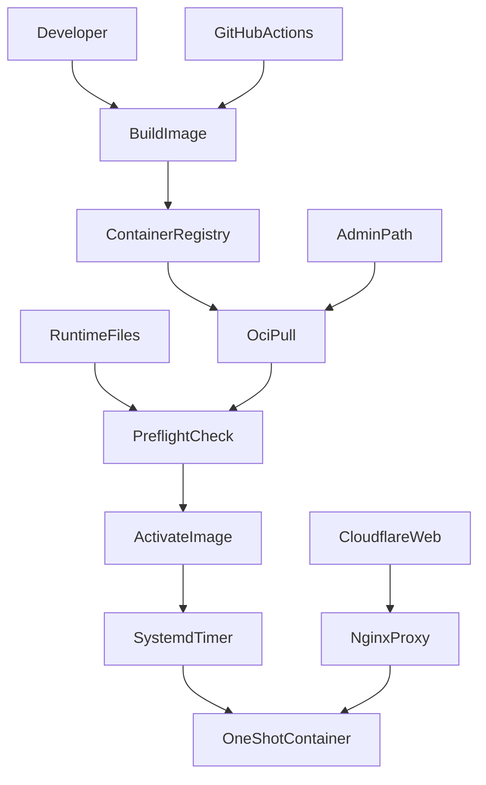
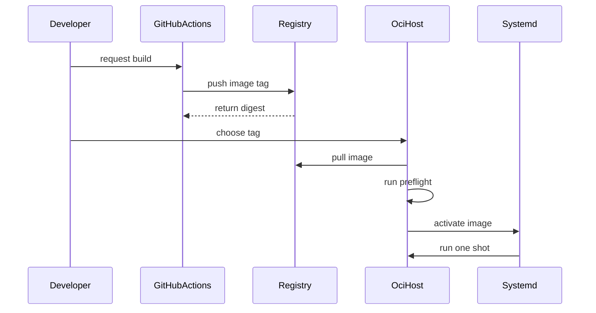
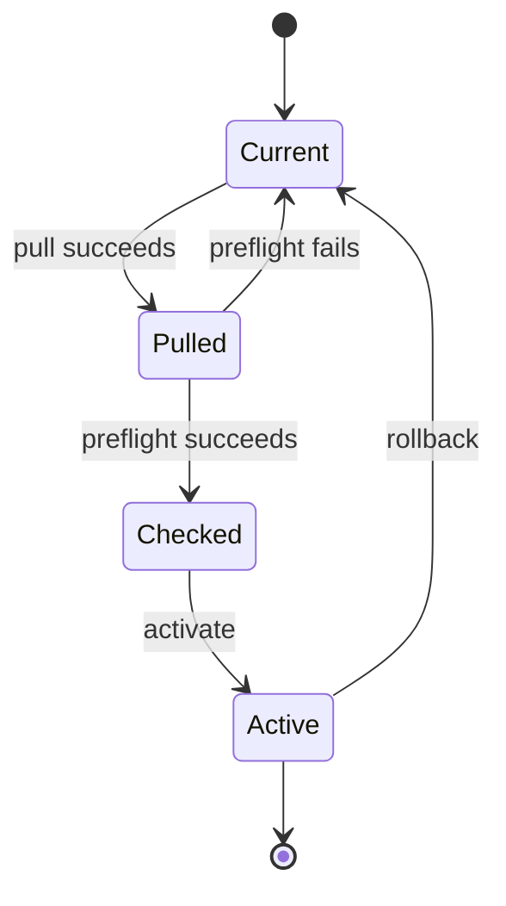
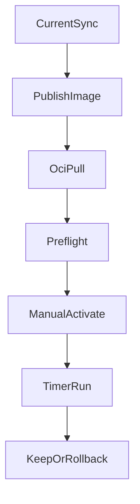

# Design Document

## Overview

この設計は Gmail Monitor のデプロイ単位を source file 同期から Docker image artifact へ移し、Cloudflare proxied Web ドメインと SSH/deploy 管理経路を分離する。対象ユーザーは開発者兼運用者であり、ローカルまたは CI で build/push した image を OCI 側で pull、preflight、activate、rollback する。

既存 `app-containerization` の Dockerfile、runtime mount contract、`scripts/container_check.py`、one-shot 実行互換性を前提にする。アプリ本体の Python 処理、Cloudflare/nginx 公開経路、OAuth/LINE webhook 設定、systemd timer schedule は維持し、運用境界だけを追加する。

### Goals
- `ghcr.io` などの registry image を本番反映単位にする。
- OCI 側で pull 後に no-external-API preflight を実行してから activate する。
- tag と digest を記録し、直前 image への rollback を可能にする。
- Web 公開 hostname と管理 hostname/tunnel を明確に分ける。

### Non-Goals
- Gmail Monitor のアプリ機能変更。
- Cloudflare/nginx の全面再設計。
- OAuth/LINE webhook URL の変更。
- Secrets 管理 SaaS、DB 化、マルチユーザー化。
- CI から OCI activate までを完全自動化すること。

## Boundary Commitments

### This Spec Owns
- Docker image registry publish/pull の運用 contract。
- OCI 上の deploy state、preflight、activate、rollback 手順。
- Web 公開経路と deploy 管理経路の分離 checklist。
- `SyncNow` を本番反映の必須経路から外す運用ドキュメント。

### Out of Boundary
- アプリの Gmail fetch、LINE push、Gemini extraction の仕様変更。
- `app-containerization` が定義済みの runtime mount contract 自体の再設計。
- Cloudflare proxied Web domain、nginx location、OAuth/LINE 外部 console の再設計。
- registry token や OCI public IP など secret/環境固有値の記録。

### Allowed Dependencies
- `app-containerization` の `Dockerfile`、`compose.yaml`、`scripts/container_check.py`。
- Docker CLI/Engine と registry credential store。
- GitHub Actions と GHCR。GHCR 以外の OCI-compatible registry へ置換可能な contract に留める。
- 既存 systemd timer/service と host nginx proxy。
- 管理経路としての DNS-only SSH hostname または Cloudflare Tunnel / Access。

### Revalidation Triggers
- Docker image name、tag policy、digest pinning policy が変わる。
- runtime file path、mount permission、`container_check.py` の検証範囲が変わる。
- systemd service の実行方式または timer schedule が変わる。
- Web 公開 hostname と管理 hostname/tunnel の責務が統合または変更される。
- registry provider、package visibility、authentication method が変わる。

## Architecture

### Existing Architecture Analysis

現行は `SyncNow` で source tree を OCI の project directory に同期し、OCI 側で build/run する前提を含む。Docker 化成果物は既に存在し、`container_check.py` は external API を叩かずに image/runtime の最低限の健全性を確認できる。

本設計は source tree を本番反映単位にしない。source は build input、registry image は deploy input、OCI runtime files は host 側 input として分離する。

### Architecture Pattern & Boundary Map

Selected pattern: **Registry artifact promotion with host-side activation**。



**Architecture Integration**
- Domain boundaries: build/publish、OCI deploy、network management、runtime configuration を分ける。
- Existing patterns preserved: one-shot process、host `127.0.0.1:8080`、runtime files outside image。
- New components rationale: registry publish workflow と OCI deploy script は source sync を代替するために必要。
- Steering compliance: secret/token は source と spec に記録せず、公開 path は callback に必要なものへ限定する。

### Technology Stack

| Layer | Choice / Version | Role in Feature | Notes |
|-------|------------------|-----------------|-------|
| CI | GitHub Actions | image build/push の任意自動化 | activate は行わない |
| Registry | GHCR or OCI-compatible registry | image artifact 配布 | GHCR を標準例にする |
| Runtime | Docker Engine | OCI 側 pull/check/run | 既存 Docker 化成果物を利用 |
| Operations | systemd timer/service | one-shot 起動 | schedule は維持 |
| Network | Cloudflare proxied Web plus DNS-only SSH or Tunnel | Web と管理経路の分離 | Web 経路を壊さない |

## File Structure Plan

### Directory Structure
```text
.github/
└── workflows/
    └── publish-image.yml          # GHCR publish workflow
ops/
└── oci/
    ├── deploy-image.sh            # OCI pull, preflight, activate, rollback helper
    └── deploy.env.example         # non-secret variable names and defaults
docs/
└── cloudflare-aware-deployment.md # operator runbook and network checklist
.kiro/specs/cloudflare-aware-deployment/
├── research.md                    # discovery findings and decisions
└── design.md                      # this design
```

### Modified Files
- `.dockerignore` — `.github/` and `ops/` を build context から除外し、deploy helper や workflow が image layer に入らないようにする。
- `Dockerfile` — optional label `org.opencontainers.image.source` を追加し、GHCR package と repository の関連付けを助ける。runtime behavior は変えない。
- `docs/app-containerization.md` — source sync build が第一段階の手順であり、registry deploy へ移る場合は新 runbook を参照する旨を追記する。

## System Flows

### Publish and Deploy



### OCI Activation State



## Requirements Traceability

| Requirement | Summary | Components | Interfaces | Flows |
|-------------|---------|------------|------------|-------|
| 1.1 | image tag を release candidate にする | ImagePublishWorkflow, DeployStateManifest | Batch, State | Publish and Deploy |
| 1.2 | tag と source/build 対応を残す | ImagePublishWorkflow, DeployStateManifest | State | Publish and Deploy |
| 1.3 | image 識別失敗時に本番を変えない | OciDeployController | Batch | OCI Activation State |
| 1.4 | SyncNow を必須経路から外す | DeploymentRunbook | State | Publish and Deploy |
| 2.1 | registry image に runtime files を含めない | BuildContextGuard, ImagePublishWorkflow | State, Batch | Publish and Deploy |
| 2.2 | runtime files は image 外で扱う | RuntimeContractReuse, OciDeployController | State | OCI Activation State |
| 2.3 | registry credential を固定値で記録しない | RegistryAuthBoundary, DeploymentRunbook | State | Publish and Deploy |
| 2.4 | runtime file 不足を切替前に判別する | OciPreflightCheck | Batch | OCI Activation State |
| 3.1 | OCI pull 成功を確認する | OciDeployController | Batch | Publish and Deploy |
| 3.2 | external API なしで検証する | OciPreflightCheck | Batch | OCI Activation State |
| 3.3 | preflight 失敗時に切替しない | OciDeployController | Batch | OCI Activation State |
| 3.4 | preflight 項目を追跡する | OciPreflightCheck, DeploymentRunbook | Batch, State | OCI Activation State |
| 3.5 | 切替確認手順を提供する | OciDeployController, DeploymentRunbook | Batch, State | OCI Activation State |
| 4.1 | proxied Web domain を SSH 必須にしない | NetworkPathChecklist | State | Publish and Deploy |
| 4.2 | Web hostname と管理経路を区別する | NetworkPathChecklist, DeploymentRunbook | State | Publish and Deploy |
| 4.3 | proxied address の不適切さを判別する | NetworkPathChecklist | Batch, State | Publish and Deploy |
| 4.4 | SSH 外部到達性を確認対象にする | NetworkPathChecklist | Batch | Publish and Deploy |
| 4.5 | Tunnel 使用時の到達性を確認する | NetworkPathChecklist | Batch | Publish and Deploy |
| 5.1 | one-shot flow を維持する | OciDeployController, RuntimeContractReuse | Batch | OCI Activation State |
| 5.2 | timer schedule 変更を不要にする | DeploymentRunbook | State | OCI Activation State |
| 5.3 | rollback 判断材料を提供する | OciDeployController, DeployStateManifest | Batch, State | OCI Activation State |
| 5.4 | image tag または Python 直起動へ戻せる | OciDeployController, DeploymentRunbook | Batch, State | OCI Activation State |
| 5.5 | rollback 後の確認手順を提供する | DeploymentRunbook | State | OCI Activation State |
| 6.1 | deploy stages を区別する | DeploymentRunbook | State | Publish and Deploy |
| 6.2 | 手動実行できる最小手順 | OciDeployController, DeploymentRunbook | Batch, State | Publish and Deploy |
| 6.3 | CI と手動で同じ合格条件 | ImagePublishWorkflow, OciPreflightCheck | Batch | Publish and Deploy |
| 6.4 | 失敗段階を切り分ける | OciDeployController, DeploymentRunbook | Batch, State | OCI Activation State |
| 6.5 | 後続自動化を妨げない | DeployStateManifest, DeploymentRunbook | State | Publish and Deploy |

## Components and Interfaces

| Component | Domain/Layer | Intent | Req Coverage | Key Dependencies | Contracts |
|-----------|--------------|--------|--------------|------------------|-----------|
| ImagePublishWorkflow | CI | Build and publish image | 1.1, 1.2, 2.1, 6.3 | Dockerfile P0, GHCR P0 | Batch |
| BuildContextGuard | Runtime | Keep deploy assets and secrets out of image | 2.1 | .dockerignore P0 | State |
| RegistryAuthBoundary | Operations | Keep registry credentials outside docs/source | 2.3 | Docker login P0 | State |
| OciDeployController | Operations | Pull, check, activate, rollback on OCI | 1.3, 3.1, 3.3, 3.5, 5.1, 5.3, 5.4, 6.2, 6.4 | Docker Engine P0, systemd P1 | Batch, State |
| OciPreflightCheck | Validation | Verify image/runtime before activation | 2.4, 3.2, 3.4, 6.3 | container_check.py P0 | Batch |
| DeployStateManifest | Operations | Record active and previous image identity | 1.2, 5.3, 6.5 | OCI filesystem P0 | State |
| RuntimeContractReuse | Runtime | Reuse existing runtime mount contract | 2.2, 5.1 | app-containerization P0 | State |
| NetworkPathChecklist | Network | Separate Web and deploy management paths | 4.1, 4.2, 4.3, 4.4, 4.5 | Cloudflare P1, OCI network P1 | Batch, State |
| DeploymentRunbook | Documentation | Make manual and staged deploy reproducible | 1.4, 2.3, 3.4, 3.5, 4.2, 5.2, 5.4, 5.5, 6.1, 6.2, 6.4, 6.5 | research.md P1 | State |

### CI Layer

#### ImagePublishWorkflow

| Field | Detail |
|-------|--------|
| Intent | Build and publish a versioned container image to a registry |
| Requirements | 1.1, 1.2, 2.1, 6.3 |

**Responsibilities & Constraints**
- Builds from repository source and existing `Dockerfile`.
- Publishes human-readable tags and captures the resulting digest.
- Does not activate OCI production.
- Does not print registry token values.

**Dependencies**
- Inbound: Developer or GitHub event — requests image publication (P1)
- Outbound: Dockerfile — image definition (P0)
- External: GHCR or OCI-compatible registry — image storage (P0)

**Contracts**: Batch [x] / State [ ] / Service [ ] / API [ ] / Event [ ]

##### Batch / Job Contract
- Trigger: manual workflow dispatch and optionally selected repository events.
- Input / validation: image name, tag, repository source revision.
- Output / destination: registry image tag and digest.
- Idempotency & recovery: repeated publish to same mutable tag is allowed only when deploy manifest records digest; immutable release tags should not be reused by convention.

**Implementation Notes**
- Add OCI labels where useful, especially source repository label.
- Prefer tag names that include source revision or date.
- Keep full deploy activation out of this workflow for this spec.

### Operations Layer

#### OciDeployController

| Field | Detail |
|-------|--------|
| Intent | Perform OCI-side pull, preflight, activation, and rollback |
| Requirements | 1.3, 3.1, 3.3, 3.5, 5.1, 5.3, 5.4, 6.2, 6.4 |

**Responsibilities & Constraints**
- Pulls an image by tag or digest.
- Runs preflight before changing the active runtime target.
- Updates a small state manifest only after successful validation.
- Can restore the previous image reference without changing runtime files.
- Does not own registry token creation or Cloudflare Web configuration.

**Dependencies**
- Inbound: Operator or future CI step — invokes deploy command (P0)
- Outbound: Docker Engine — pull, inspect, run (P0)
- Outbound: `scripts/container_check.py` inside image — preflight (P0)
- Outbound: systemd service config or environment drop-in — activation target (P1)

**Contracts**: Batch [x] / State [x] / Service [ ] / API [ ] / Event [ ]

##### Batch / Job Contract
- Trigger: operator command on OCI host.
- Input / validation: image reference, runtime directory, optional action `pull`, `check`, `activate`, `rollback`, `status`.
- Output / destination: deploy logs, active image reference, previous image reference.
- Idempotency & recovery: `check` is read-only; `activate` is blocked unless `check` succeeded for the same image reference; `rollback` restores previous reference when present.

##### State Management
- State model: active image, previous image, resolved digest, last checked image, last check result.
- Persistence & consistency: host-side text or env file under an operations directory; never inside the image.
- Concurrency strategy: single operator workflow; script should fail if a lock file indicates an in-progress deploy.

**Implementation Notes**
- Use digest when available for activation stability.
- Return non-zero exit codes per failure stage.
- Keep command output actionable but avoid printing secret values.

#### DeployStateManifest

| Field | Detail |
|-------|--------|
| Intent | Persist deploy identity and rollback target |
| Requirements | 1.2, 5.3, 6.5 |

**Responsibilities & Constraints**
- Records current and previous deployable image identity.
- Separates tag, digest, source revision, timestamp, and check status.
- Avoids secret values and host-specific network addresses where possible.

**Dependencies**
- Inbound: OciDeployController — reads and writes deploy state (P0)
- Outbound: OCI host filesystem — persistent state (P0)

**Contracts**: State [x]

##### State Management
- State model: `ACTIVE_IMAGE`, `ACTIVE_DIGEST`, `PREVIOUS_IMAGE`, `PREVIOUS_DIGEST`, `LAST_CHECKED_IMAGE`, `LAST_CHECK_STATUS`.
- Persistence & consistency: shell-readable env format or JSON; design allows either, implementation chooses one.
- Concurrency strategy: written atomically through temporary file and rename.

#### OciPreflightCheck

| Field | Detail |
|-------|--------|
| Intent | Validate pulled image and runtime inputs before activation |
| Requirements | 2.4, 3.2, 3.4, 6.3 |

**Responsibilities & Constraints**
- Runs the existing no-external-API validation inside the candidate image.
- Confirms runtime files and log path are readable/writable as expected.
- Confirms host loopback and callback checks are listed for operator verification.

**Dependencies**
- Inbound: OciDeployController — invokes preflight (P0)
- Outbound: Candidate image — contains `scripts/container_check.py` (P0)
- Outbound: Runtime files — `/opt/gmm_runtime` or configured equivalent (P0)

**Contracts**: Batch [x]

##### Batch / Job Contract
- Trigger: after pull and before activate.
- Input / validation: candidate image reference, runtime directory, env file.
- Output / destination: pass/fail status and diagnostic stage.
- Idempotency & recovery: repeated checks do not mutate production target; token writability check may open the token file without changing semantic content.

### Runtime and Security Layer

#### BuildContextGuard

| Field | Detail |
|-------|--------|
| Intent | Prevent operational files and secrets from entering image layers |
| Requirements | 2.1 |

**Responsibilities & Constraints**
- Excludes `.github/`, `ops/`, local env files, token files, credentials, logs, notes, and screenshots from image context.
- Preserves app modules and `scripts/container_check.py` needed by runtime/check.

**Dependencies**
- Inbound: ImagePublishWorkflow — depends on clean build context (P0)
- Outbound: `.dockerignore` — exclusion source (P0)

**Contracts**: State [x]

#### RegistryAuthBoundary

| Field | Detail |
|-------|--------|
| Intent | Keep registry authentication outside tracked project artifacts |
| Requirements | 2.3 |

**Responsibilities & Constraints**
- Documents required credential shape without recording values.
- Uses Docker credential storage or environment input on OCI.
- Distinguishes publish permission from pull permission.

**Dependencies**
- Inbound: Operator — configures registry login (P0)
- External: GHCR or chosen registry — authenticates pull/push (P0)

**Contracts**: State [x]

#### RuntimeContractReuse

| Field | Detail |
|-------|--------|
| Intent | Preserve existing runtime file contract from app-containerization |
| Requirements | 2.2, 5.1 |

**Responsibilities & Constraints**
- Reuses `.env`, `credentials.json`, `token.json`, `filters.json`, and `log/` as host-provided runtime inputs.
- Does not change filter schema or OAuth token behavior.
- Keeps host loopback publishing and one-shot container behavior.

**Dependencies**
- Inbound: OciDeployController — invokes candidate image with runtime mounts (P0)
- Outbound: Existing app runtime configuration — path/env behavior (P0)

**Contracts**: State [x]

### Network and Documentation Layer

#### NetworkPathChecklist

| Field | Detail |
|-------|--------|
| Intent | Validate Web and deploy management paths are not conflated |
| Requirements | 4.1, 4.2, 4.3, 4.4, 4.5 |

**Responsibilities & Constraints**
- Records that proxied Web domain is not the default SSH/rsync target.
- Provides separate checks for DNS-only SSH hostname and Cloudflare Tunnel.
- Treats OCI `sshd` listen state as necessary but not sufficient for external reachability.

**Dependencies**
- Inbound: Operator — follows checklist (P0)
- External: Cloudflare DNS/Tunnel — Web and optional management path (P1)
- External: OCI Security List / NSG — SSH external reachability when DNS-only SSH is used (P1)

**Contracts**: Batch [x] / State [x]

##### Batch / Job Contract
- Trigger: before relying on SSH or Tunnel for deploy control.
- Input / validation: selected management path type.
- Output / destination: pass/fail notes in runbook checklist.
- Idempotency & recovery: checks do not modify Web domain configuration.

#### DeploymentRunbook

| Field | Detail |
|-------|--------|
| Intent | Provide operator-facing staged deploy and rollback instructions |
| Requirements | 1.4, 2.3, 3.4, 3.5, 4.2, 5.2, 5.4, 5.5, 6.1, 6.2, 6.4, 6.5 |

**Responsibilities & Constraints**
- Documents build, push, pull, preflight, activate, rollback stages.
- Shows placeholder variables, not real domains, IPs, tokens, or secrets.
- Explains how to interpret failure stage and where to look next.
- References existing app-containerization runbook for runtime mount basics.

**Dependencies**
- Inbound: Operator — uses runbook (P0)
- Outbound: OciDeployController — command examples (P0)
- Outbound: NetworkPathChecklist — management path checks (P1)

**Contracts**: State [x]

## Data Models

### Domain Model

- **Image Reference**: registry image name plus tag or digest.
- **Deploy Candidate**: image reference that has been pulled but not yet activated.
- **Active Release**: image reference currently used by systemd one-shot.
- **Previous Release**: image reference available for rollback.
- **Management Path**: DNS-only SSH or Cloudflare Tunnel route used for deploy control.

### Logical Data Model

| Entity | Attributes | Natural Key | Notes |
|--------|------------|-------------|-------|
| DeployState | active image, active digest, previous image, previous digest, last checked image, check status, timestamp | active digest | Host-local operational state |
| PublishedImage | registry, namespace, image name, tag, digest, source revision | digest | Produced by publish workflow |
| NetworkPathRecord | web hostname kind, management path kind, last check result | management path kind | Documentation/checklist record |

### Data Contracts & Integration

`DeployState` must not contain registry token, OCI public IP, OAuth credentials, LINE credentials, or real secret values. If implementation uses shell env format, values must be shell-safe and quoted consistently. If implementation uses JSON, field names must remain stable for future CI automation.

## Error Handling

### Error Strategy

Deploy errors are classified by stage: build, registry, OCI pull, preflight, activate, runtime, rollback. Each stage returns a distinct non-zero result or documented failure marker so the operator can stop before production changes when possible.

### Error Categories and Responses

- **Build errors**: workflow fails before publishing; no OCI state changes.
- **Registry errors**: login/push/pull failure; candidate image is not activated.
- **Preflight errors**: missing runtime file, bad permission, import failure, route failure; active image remains unchanged.
- **Activate errors**: systemd environment or service update failure; previous active image remains the rollback target.
- **Runtime errors**: container start, port bind, callback, or exit status failure; operator can rollback by previous image or Python direct command.

### Monitoring

- OCI deploy script prints stage names and the candidate image reference.
- systemd journal remains the source for one-shot run status.
- File logging through mounted runtime log remains available from `app-containerization`.

## Testing Strategy

### Unit / Script Tests
- Validate deploy state parsing and update behavior for 1.2, 5.3, 6.5.
- Validate image reference parsing for tag and digest forms for 1.1, 3.1.
- Validate failure stage mapping returns distinct operator messages for 6.4.

### Integration Tests
- Run publish workflow in dry-run or local equivalent to confirm `.env`, tokens, runtime files, `.github/`, and `ops/` do not enter image context for 2.1.
- Run OCI deploy script against a local image reference with a temporary runtime directory and confirm preflight blocks activation on missing files for 2.4, 3.3.
- Run preflight with valid runtime files and confirm `scripts/container_check.py` succeeds without external API calls for 3.2.

### Manual OCI Validation
- Pull a candidate image on OCI and confirm digest is recorded for 1.2, 3.1.
- Activate candidate image and run the systemd service manually before waiting for timer execution for 3.5, 5.1.
- Confirm `curl http://127.0.0.1:8080/health` during container run and nginx callback reachability checklist for 3.4, 5.3.
- Execute rollback to previous image and verify journal after manual service run for 5.4, 5.5.

### Network Validation
- For DNS-only SSH, confirm management hostname resolves to origin-managed address rather than Cloudflare proxied address for 4.3.
- For DNS-only SSH, confirm OCI Security List / NSG permits the intended source before relying on port 22 for 4.4.
- For Cloudflare Tunnel, confirm client-side management connection works without changing Web public hostname for 4.5.

## Security Considerations

- Registry tokens are never committed, written into specs, or echoed in documented commands.
- Private image pull on OCI uses least-privilege package read credentials where supported.
- Build context excludes operational scripts and workflow metadata unless explicitly needed.
- Runtime secrets remain outside image and are mounted or injected at run time.
- Cloudflare proxied Web domain remains separate from SSH/deploy management path.

## Migration Strategy



### Phases
1. Add publish workflow, deploy helper, and runbook without changing production execution.
2. Publish first candidate image and record tag/digest.
3. On OCI, login to registry and pull candidate image.
4. Run preflight with existing runtime files.
5. Activate image for manual systemd service run.
6. Observe next timer run.
7. Roll back to previous image or Python direct command if activation/runtime checks fail.

## Supporting References

- [GHCR container registry docs](https://docs.github.com/en/packages/working-with-a-github-packages-registry/working-with-the-container-registry) — registry auth, push, pull, digest.
- [Docker image pull docs](https://docs.docker.com/reference/cli/docker/image/pull/) — tag pull, digest pull, registry credential behavior.
- [Cloudflare Tunnel docs](https://developers.cloudflare.com/tunnel/) — outbound tunnel and SSH/TCP support.
- [Cloudflare SSH with cloudflared docs](https://developers.cloudflare.com/cloudflare-one/networks/connectors/cloudflare-tunnel/use-cases/ssh/ssh-cloudflared-authentication/) — optional management path through Tunnel and Access.
